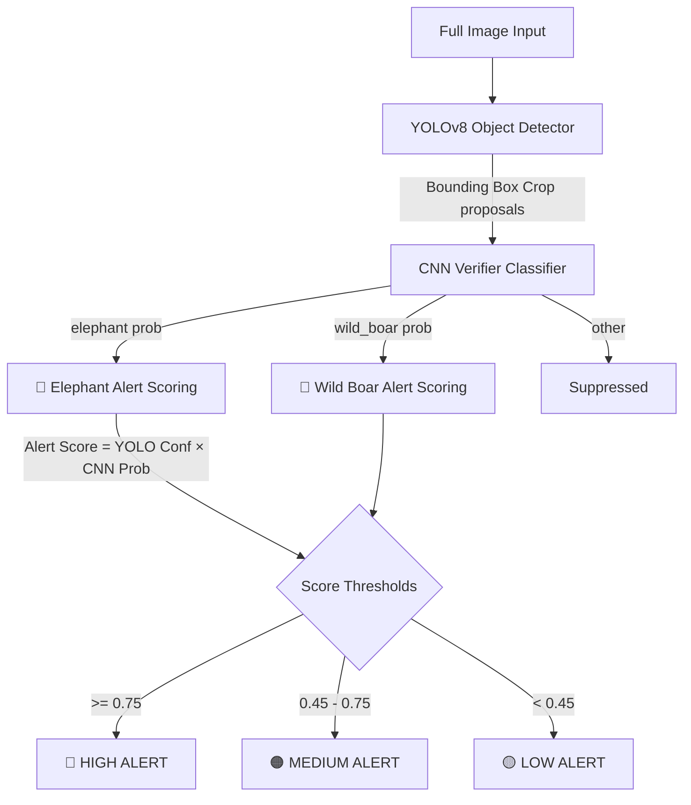

# Real-Time Wild Animal Intrusion Detection and Alert System

This repository implements a modular, two-stage deep learning pipeline designed to detect wild animal intrusions (focusing on **Elephants** and **Wild Boars**) in farm and border regions to minimize human-wildlife conflict.

By integrating a state-of-the-art detector with a multi-species verification stage, the system dramatically reduces false alarms caused by moving foliage, shadows, lighting changes, or non-target animals. Adding a new species requires **only a new dataset** — no architectural changes needed.

---

## 1. Problem Statement & Architecture

### The Problem
Single-stage detectors (like YOLO) are fast, making them ideal for edge deployment. However, in cluttered outdoor environments, they are prone to false positives. Triggering physical sirens or notifying local guards on false alarms causes alarm fatigue and wastes resources.

### The Two-Stage Multi-Species Solution
Our system decouples detection and verification:
1. **Stage 1: Proposal (YOLOv8):** A fine-tuned YOLOv8 nano model scans the full camera feed for candidate animal bounding boxes.
2. **Stage 2: Verification (CNN Classifier):** Candidate detections are cropped and sent to a lightweight custom CNN verifier. The verifier classifies the crop as `elephant`, `wild_boar`, or `other` (background, humans, non-target animals).



---

## 2. Dataset Context

The system uses **two primary datasets** plus an optional **species-extension dataset**:

1. **Elephant Thermal Dataset (`elephant_thermal.zip`):** Roboflow-exported dataset with bounding box annotations. Class 0 = elephant.
2. **Snapshot Serengeti Dataset (`serangetti.zip`):** Camera-trap images (`blank` / `non_blank`) used as negative examples.
3. **Wild Boar Dataset (`wildboar.zip`) *(optional)*:** Any Roboflow YOLOv8-format dataset for wild boars. Provide via `--wildboar_zip`.

### Data Preprocessing
The preprocessing stage extracts all zips and creates a **balanced multi-species CNN dataset**:

| Mode | Folders created | Classes |
|---|---|---|
| Elephant only | `elephant/`, `other/` | 2 |
| Elephant + Wild Boar | `elephant/`, `wild_boar/`, `other/` | 3 |

---

## 3. Module Overview

All logic is separated into structured modules under `src/`:
- **[preprocessing.py](file:///c:/Users/aakhi/OneDrive/Desktop/DL%20PROJECT/src/preprocessing.py)**: Handles extraction and balances target/other crop sets.
- **[yolo_training.py](file:///c:/Users/aakhi/OneDrive/Desktop/DL%20PROJECT/src/yolo_training.py)**: Resolves paths dynamically and trains YOLOv8 on thermal data.
- **[crop_generation.py](file:///c:/Users/aakhi/OneDrive/Desktop/DL%20PROJECT/src/crop_generation.py)**: Runs YOLO on test images and dumps crops + metadata CSV.
- **[cnn_training.py](file:///c:/Users/aakhi/OneDrive/Desktop/DL%20PROJECT/src/cnn_training.py)**: Trains the custom verifier with color jitter and RandomErasing (occlusion mask) augmentations.
- **[inference.py](file:///c:/Users/aakhi/OneDrive/Desktop/DL%20PROJECT/src/inference.py)**: Orchestrates inference, computes alert calibration scores, and color-codes bounding boxes.
- **[evaluation.py](file:///c:/Users/aakhi/OneDrive/Desktop/DL%20PROJECT/src/evaluation.py)**: Reports precision, recall, and F1 comparisons, and plots confusion matrices.
- **[explainability.py](file:///c:/Users/aakhi/OneDrive/Desktop/DL%20PROJECT/src/explainability.py)**: Implements Grad-CAM heatmaps overlayed on verification crops.

---

## 4. Advanced Experimental Extensions

Scaffolds for advanced research are located under `src/experimental/`:
- **[ssl_pretraining.py](file:///c:/Users/aakhi/OneDrive/Desktop/DL%20PROJECT/src/experimental/ssl_pretraining.py)**: Contrastive representation learning (SimCLR framework) with NT-Xent loss to pretrain backbones on raw unlabeled Serengeti images.
- **[curriculum_learning.py](file:///c:/Users/aakhi/OneDrive/Desktop/DL%20PROJECT/src/experimental/curriculum_learning.py)**: Difficulty scoring (based on crop size and sharpness/variance of laplacian) and pacing windows to stabilize early training.
- **[attention_heads.py](file:///c:/Users/aakhi/OneDrive/Desktop/DL%20PROJECT/src/experimental/attention_heads.py)**: Spatial multi-head self-attention module that plugs into the CNN verifier to capture long-range contextual spatial details.
- **[temporal_modeling.py](file:///c:/Users/aakhi/OneDrive/Desktop/DL%20PROJECT/src/experimental/temporal_modeling.py)**: Sliding-window frame accumulator to estimate threat level: *Passing Animal* (low threat) vs *Persistent Intrusion* (high threat), alongside a recurrent LSTM trajectory classifier.
- **[compression.py](file:///c:/Users/aakhi/OneDrive/Desktop/DL%20PROJECT/src/experimental/compression.py)**: Dynamic quantization (FP32 to INT8) and Conv2D L1-unstructured pruning to compress the network for real-time edge device deployment.

---

## 5. Execution Guide

All stages are run through the main CLI:

### Elephant-Only Pipeline (original)
```bash
# 1. Extract zip files and prepare balanced CNN crops
python main.py --preprocess

# 2. Train YOLOv8 detector (CPU-friendly settings)
python main.py --train-yolo --epochs 3 --batch 8

# 3. Train the CNN Verifier (2-class: elephant / other)
python main.py --train-cnn --epochs 5

# 4. Run the combined YOLO+CNN detection and alerting demo
python main.py --demo-pipeline

# 5. Evaluate metrics (YOLO vs YOLO+CNN) and plot confusion matrix
python main.py --evaluate
```

### Multi-Species Pipeline (Elephant + Wild Boar)
```bash
# 1. Extract both datasets and build 3-class CNN crops
python main.py --preprocess --wildboar_zip path/to/wildboar.zip

# 2. Train YOLO on combined dataset
python main.py --train-yolo --epochs 20 --combined

# 3. Train the CNN Verifier (3-class: elephant / wild_boar / other)
python main.py --train-cnn --epochs 10

# 4-5. Demo and evaluate — same commands, now multi-species aware
python main.py --demo-pipeline
python main.py --evaluate
```

### Explainability & Advanced Experiments
```bash
# 6. Generate Grad-CAM visualization for a crop image
python main.py --explain --crop_file runs/generated_crops/crop_00000_00_animal.jpg

# 7. Pretrain backbones using Contrastive Self-Supervised Learning
python main.py --ssl-pretrain --epochs 3

# 8. Quantize and prune the CNN verifier
python main.py --compress
```

### Adding a Third Species (Future)
The architecture is fully extensible. To add a third species (e.g., leopard):
1. Provide a labeled dataset zip
2. Add it to preprocessing (similar to wild boar)
3. Retrain the CNN — the architecture auto-adjusts to N classes
4. Add a new entry to `SPECIES_CONFIG` in `inference.py`
